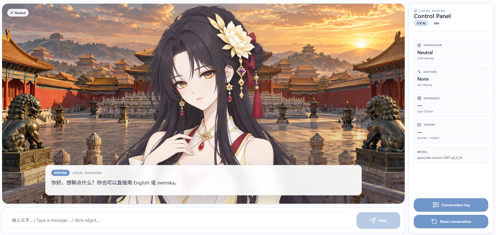

# AI Avatar — Local Qwen Visual Novel Agent (Updated 2026 Oct)

## Overview

AI Avatar is a local-first embodied AI project built around a visual-novel-style interface.

The project uses a local Qwen model for dialogue and semantic avatar decisions, CosyVoice3 for local text-to-speech, and SQLite for persistent conversations and runtime telemetry.

The LLM is responsible for semantic decisions such as what to say, what emotion to express, and what gesture to request. Deterministic C# code remains responsible for validation, application state, persistence, animation policy, timing, and TTS control.

The current version uses keyboard text input and local speech output. No cloud API key is required for the main runtime path.



## Problem

A conversational avatar needs to do more than generate text.

The system needs to coordinate several independent concerns:

- language generation
- avatar emotion
- avatar gesture
- local speech synthesis
- runtime state
- conversation persistence
- inference telemetry
- responsive UI behavior

Allowing the LLM to directly control low-level animation, application state, database operations, or arbitrary TTS parameters would make the system difficult to validate and debug.

The goal of this project is

> Making a small local language model drive an embodied character while keeping low-level behavior deterministic, observable, and under application control.

## Tech Stack

- Next.js
- React
- TypeScript
- Tailwind CSS 4
- shadcn/ui
- Base UI
- ASP.NET Core
- .NET 10
- C# 14
- Entity Framework Core
- SQLite
- Ollama
- Qwen 4B
- CosyVoice3
- Python 3.10
- PyTorch

## Trade off

### Local models instead of cloud APIs

The project currently uses local Qwen inference through Ollama and local CosyVoice3 speech synthesis.

This increases local hardware requirements and makes inference slower than some hosted APIs. It also requires managing model files and Python dependencies locally.

However, it keeps the primary runtime self-contained and allows the project to experiment with model behavior, telemetry, prompting, and future fine-tuning without depending on a cloud provider.

The current runtime is therefore centered around:

- Ollama -> local LLM inference
- Qwen -> dialogue and semantic avatar decisions
- ASP.NET Core -> validation and application control
- CosyVoice3 -> local speech synthesis
- SQLite -> conversation and telemetry persistence
- Next.js -> avatar interface and interaction

### Semantic LLM control instead of direct avatar control

The LLM does not directly control CSS transforms, animation distances, runtime state, database operations, or raw speech parameters.

Instead, Qwen returns a structured semantic decision:

```json
{
  "speech": "你好。今天想聊些什么？",
  "emotion": "happy",
  "emotionIntensity": 0.65,
  "gesture": "nod",
  "gestureIntensity": 0.35
}
```

C# validates the result and converts it into deterministic application behavior.

For example:

```text
Qwen
 ↓
sad + jump
 ↓
C# motion policy
 ↓
sad + none
```

This adds application logic, but makes avatar behavior easier to validate, test, and extend.

## Why I used SQLite

Earlier versions kept the active conversation only in frontend state.

That works for a simple single-session prototype, but becomes difficult once the project needs to store multiple conversations, messages, LLM telemetry, and TTS telemetry.

JSON was also considered, but the data now has clear relationships:

```text
Conversation
    │
    └── Message
          ├── LlmTelemetry
          └── TtsTelemetry
```

The project currently stores:

- Conversations
- Messages
- LlmTelemetry
- TtsTelemetry

SQLite fits the current project because the application is still local-first and normally runs for one user on one machine.

It provides:

- relational data modeling
- transactions
- indexes
- foreign keys
- SQL queries
- EF Core migrations
- a single local database file
- no separate database server

The database is stored locally at:

```text
backend/data/avatar.db
```

PostgreSQL would provide stronger server-side concurrency and multi-user capabilities, but that complexity is not currently required.

If the project later becomes a remote multi-user service, PostgreSQL would be a more appropriate next step.

## Why I used Entity Framework Core

The ASP.NET Core backend uses Entity Framework Core as the persistence layer instead of writing SQL directly throughout the application.

Database access is kept behind `ConversationStore` so avatar, Ollama, and speech logic do not depend directly on SQLite.

Conceptually:

```text
API Endpoint
 ↓
ConversationStore
 ↓
Entity Framework Core
 ↓
SQLite
```

This keeps persistence concerns separate from Qwen, CosyVoice, and frontend behavior.

EF Core migrations are also committed to Git, while generated database files are ignored.

## Why I used Qwen with Ollama

The current model is:

```text
qwen3:4b-instruct-2507-q4_K_M
```

A small local model is useful for experimenting with constrained structured output, personality, semantic emotion, gesture selection, and future model specialization.

The current architecture also makes it possible to compare smaller and larger models without changing the rest of the avatar system.

Ollama provides the local model runtime and HTTP API while ASP.NET Core owns application-level validation and telemetry.

The server-side `OllamaRequestFactory` owns request construction and the conversation window sent to the model. The frontend sends the active conversation without duplicating model-context limits.

## Why I used CosyVoice3

The project uses:

```text
FunAudioLLM/Fun-CosyVoice3-0.5B-2512
```

CosyVoice3 provides local text-to-speech and supports reference-based voice generation.

A custom avatar voice can be defined through:

```text
tools/cosyvoice/voice/reference.wav
tools/cosyvoice/voice/reference.txt
```

Qwen does not directly choose unrestricted TTS parameters.

Instead:

```text
Qwen emotion
     ↓
C# TTS policy
     ↓
bounded voice instruction
     ↓
CosyVoice3
     ↓
WAV
```

The current project keeps the full CosyVoice runtime dependency path rather than maintaining a custom dependency-pruned environment, because some upstream packages are imported indirectly during model initialization.

## Conversation Persistence

A new conversation begins without a conversation ID.

```text
First user message
       ↓
conversationId = null
       ↓
ASP.NET Core
       ↓
Create Conversation
       ↓
Store User Message
       ↓
Qwen
       ↓
Store Assistant Message
       ↓
Store LLM Telemetry
       ↓
Return conversationId
```

Later messages reuse the same `conversationId`.

Each successful assistant response also receives an `assistantMessageId`.

That identifier connects the generated text with its TTS telemetry:

```text
Conversation
     ↓
Assistant Message
     ├─ LlmTelemetry
     └─ TtsTelemetry
```

Resetting the frontend conversation starts a new conversation locally, but does not delete previously persisted SQLite records.

## Telemetry

The project records model execution information instead of relying only on values displayed in the UI.

LLM telemetry currently includes:

- model
- total inference duration
- model load duration
- prompt tokens
- output tokens

TTS telemetry currently includes:

- model
- voice source
- synthesis duration
- CUDA usage
- FP16 usage
- audio duration field
- real-time factor field

This allows later versions of the project to compare different models and optimization strategies using measured data instead of subjective impressions.

For example:

```text
Qwen 4B vs Qwen 8B

FP32 vs FP16

different reference voices

different TTS policies

different prompt configurations
```

## Shared UI system

The UI architecture separates responsibilities across three layers:

- shadcn/ui and Base UI provide UI primitives
- Tailwind CSS handles component styling and layout
- native CSS handles avatar composition, animation, and shared visual behavior

Native CSS is kept for cases where it is clearer than utility classes, such as:

- avatar animations
- pseudo-elements
- complex gradients
- `color-mix()`
- character composition
- runtime motion variables

The project intentionally keeps Tailwind classes compact and avoids a large responsive-token layer.

Shared UI logic follows the DRY (Don't Repeat Yourself) principle by keeping genuinely shared knowledge[^1] and behavior[^2] in a single source of truth.

Generic UI primitives do not know about Qwen, avatar emotions, gestures, CosyVoice, or SQLite.

## Responsive Design

The current interface uses a deliberately simple responsive strategy focused on predictable Full HD desktop behavior.

Components use straightforward Tailwind breakpoint utilities instead of a large system of shared responsive sizing tokens.

For example:

```text
Viewport
    ↓
Tailwind breakpoint utilities
    ↓
page grid / composer layout / typography adjustments
```

At Full HD desktop widths, the main page keeps a large avatar area beside a fixed-width telemetry sidebar.

On narrower screens, the layout stacks naturally instead of trying to proportionally scale the whole interface.

The telemetry sidebar can scroll vertically when available height is limited.

The project avoids page-level:

```text
zoom
transform: scale(...)
clamp()-driven whole-page sizing
complex responsive token systems
```

Instead, only the layout pieces that need adaptation use simple breakpoint rules:

- main page columns
- avatar stage minimum height
- input and send-button layout
- dialogue typography

The current priority is a clear and stable Full HD desktop layout, with a reasonable stacked fallback for smaller screens rather than exhaustive tuning for every viewport size.

[^1]: Knowledge: shared rules, definitions, configuration, and facts that the system needs to know.
[^2]: Behavior: reusable logic or processing that the system performs.

## Architecture

```text
User keyboard input
        ↓
Next.js
        ↓
ASP.NET Core
        ├──────────────────────────────→ SQLite
        │                                ├─ Conversations
        │                                ├─ Messages
        │                                ├─ LlmTelemetry
        │                                └─ TtsTelemetry
        ↓
Ollama
        ↓
Qwen 4B
        ↓
Structured Avatar Decision
        ↓
C# Validation
        ├─ Motion Policy
        ├─ Persistence
        └─ TTS Policy
              ↓
          CosyVoice3
              ↓
             WAV
              ↓
       Browser Audio
              ↓
Avatar UI + expression + gesture
```

## Runtime Workflow

```text
idle
 ↓
User message
 ↓
SQLite
 ↓
thinking
 ↓
Qwen
 ↓
Assistant message
 ↓
SQLite + LLM telemetry
 ↓
synthesizing
 ↓
CosyVoice3
 ↓
SQLite + TTS telemetry
 ↓
speaking
 ↓
audio playback ends
 ↓
short expression hold
 ↓
neutral / idle
```

If TTS fails, the text response remains available.

Speech synthesis is treated as an enhancement layer rather than a dependency for successful text interaction.

## Project Structure

```text
frontend/
├─ app/
│  ├─ globals.css
│  ├─ layout.tsx
│  └─ page.tsx
├─ components/
│  ├─ ui/
│  ├─ AvatarStage.tsx
│  ├─ ChatComposer.tsx
│  ├─ ChatLogModal.tsx
│  ├─ ChatPanel.tsx
│  └─ TelemetrySidebar.tsx
├─ hooks/
│  ├─ useAvatarSpeech.ts
│  └─ useChatSession.ts
├─ lib/
│  ├─ api.ts
│  └─ utils.ts
└─ types/
   └─ chat.ts

backend/
├─ Data/
│  ├─ AvatarDbContext.cs
│  └─ Entities/
├─ Endpoints/
│  ├─ ChatEndpoints.cs
│  ├─ HealthEndpoints.cs
│  └─ SpeechEndpoints.cs
├─ Migrations/
├─ Models/
├─ Options/
├─ Services/
│  ├─ Ollama/
│  │  ├─ AvatarDecisionSchema.cs
│  │  ├─ OllamaClient.cs
│  │  ├─ OllamaRequestFactory.cs
│  │  └─ OllamaResponseParser.cs
│  ├─ Persistence/
│  ├─ Speech/
│  ├─ AvatarDecisionValidator.cs
│  ├─ AvatarMotionPolicy.cs
│  ├─ AvatarSystemPrompt.cs
│  └─ ChatRequestValidator.cs
├─ data/
│  └─ avatar.db
├─ Program.cs
└─ appsettings.json

scripts/
├─ run-dev.ps1
├─ setup.ps1
├─ setup-cosyvoice.ps1
└─ verify.ps1

RUN_WINDOWS.cmd
SETUP_WINDOWS.cmd
VERIFY_WINDOWS.cmd
RUN_COSYVOICE_WINDOWS.cmd
SETUP_COSYVOICE_WINDOWS.cmd

tools/
├─ cosyvoice/
│  ├─ .venv/
│  ├─ CosyVoice/
│  ├─ models/
│  └─ voice/
└─ cosyvoice-service/
   └─ server.py
```

## Development

Requirements:

```text
Windows 11
.NET 10 SDK
Node.js 24+
npm
Python 3.10
Git
Ollama
```

Install CosyVoice:

```powershell
.\SETUP_COSYVOICE_WINDOWS.cmd
```

Install the project:

```powershell
.\SETUP_WINDOWS.cmd
```

The setup script checks the required local tools, starts Ollama when necessary, pulls the configured Qwen model if it is missing, restores the .NET backend, installs frontend dependencies, and runs the frontend checks.

The configured Qwen model can also be pulled manually:

```powershell
ollama pull qwen3:4b-instruct-2507-q4_K_M
```

Run:

```powershell
.\RUN_WINDOWS.cmd
```

`RUN_WINDOWS.cmd` is the Windows entry point and delegates the development startup logic to `scripts/run-dev.ps1`.

The startup script attempts to start the Ollama Windows application without blocking indefinitely, then starts the ASP.NET Core backend and Next.js frontend.

The backend starts the configured CosyVoice service automatically when local TTS is enabled.

If Ollama is not ready within the short startup window, backend and frontend startup still continues so the project does not remain stuck at the Ollama launch step.

Local services:

```text
Frontend:   http://localhost:3000
Backend:    http://localhost:5191
Ollama:     http://localhost:11434
CosyVoice:  http://127.0.0.1:8188
```

## Database

The SQLite database is:

```text
backend/data/avatar.db
```

It can be inspected with tools such as:

- DBeaver
- DataGrip
- SQLiteStudio
- DB Browser for SQLite
- VS Code SQLite extensions

Example:

```sql
SELECT *
FROM Messages
ORDER BY CreatedAtUtc DESC;
```

LLM telemetry:

```sql
SELECT *
FROM LlmTelemetry
ORDER BY CreatedAtUtc DESC;
```

TTS telemetry:

```sql
SELECT *
FROM TtsTelemetry
ORDER BY CreatedAtUtc DESC;
```

## Design Principle

> **LLM for semantic decisions. Deterministic code for control.**

The project explores how a small local language model can drive an embodied interface while keeping runtime state, persistence, motion, validation, and speech-generation behavior under deterministic application control.
